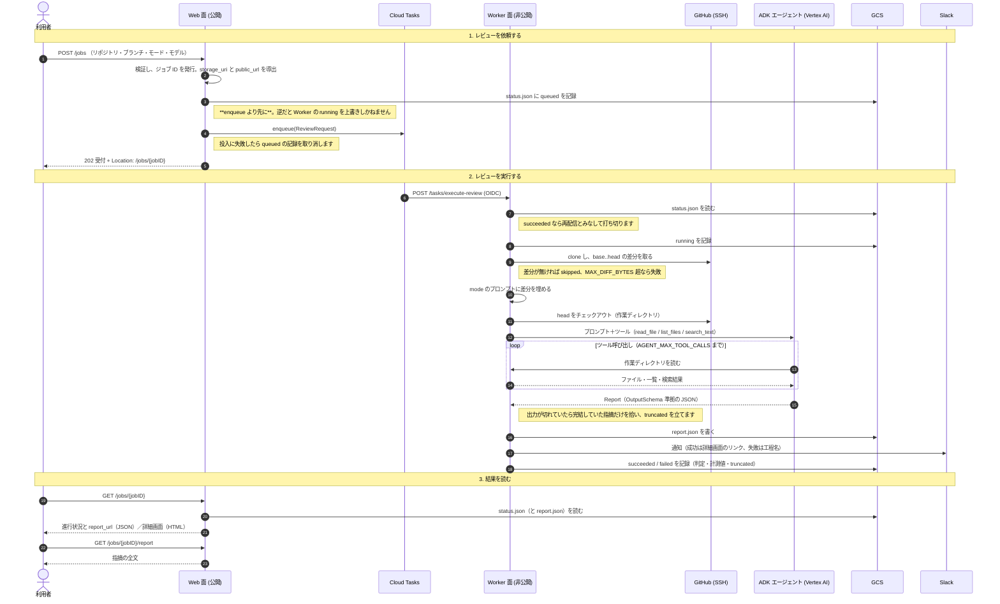

# 🤖 ADK Review

[](https://github.com/shouni/adk-review/actions/workflows/ci.yml)
[](#)
[](https://go.dev/)
[](https://cloud.google.com/run)
[](https://opensource.org/licenses/MIT)

## 🚀 概要 (About) - 人もエージェントも、同じ URL でレビューを頼む

**ADK Review** は、Git リポジトリの差分を AI エージェントにレビューさせる Cloud Run + Cloud Tasks 上の
サービスです。

リポジトリの URL と比較する 2 つのブランチ、レビューモードを渡すと、[ADK for Go](https://github.com/google/adk-go)
のエージェントが head をチェックアウトした作業ディレクトリを読み取り専用ツール（`read_file` / `list_files` /
`search_text`）で調べ、**差分の外**と突き合わせてから指摘をまとめます。差分だけでは見えない
「前の章との矛盾」「登場人物の設定の一貫性」「変更した関数の呼び出し元」が拾えます。
主用途は Git で管理している記事・小説の原稿とソースコードで、何を見るかは `assets/prompts/` の
モード（`article` / `novel` / `code`）で切り替えます。

画面用と API 用でルートを分けていません。ブラウザのフォームからでも、MCP ゲートウェイ経由の
エージェントからでも、同じ URL で依頼して結果を読めます。結果は判定（`Blocker` / `Major` / `Minor` /
`None`）と指摘の一覧で、履歴に並びます。モデルの出力が上限で切れた場合は、完結していた指摘だけを
`✂ 部分` として残し、一覧と詳細にそう表示します。差分の大きさ・所要時間・トークン使用量・
ツール呼び出し回数は、失敗した実行も含めて履歴から読めます。

1 つのイメージを `SERVER_ROLE` で **Web 面（公開）と Worker 面（非公開）の 2 サービス**として
デプロイします。レビューの手順そのものは [`go-review-kit`](https://github.com/shouni/go-review-kit) に、
ジョブの記録とページングは [`go-job-kit`](https://github.com/shouni/go-job-kit) に委ね、本リポジトリは
依頼の受付・認証・非同期実行・結果の保存と提供（画面と JSON API）、そしてレビュアー（ADK エージェント）の
実装を担います。

---

## 📦 使い方

### 1. 環境設定

`ValidateEssentialConfig` はロールごとに必要なものだけを検証します。担当しない面の設定は
読みません（worker 面は OAuth 系を要求しません）。Duration や整数の書式が不正な値は、既定値へ
落とさず起動時にエラーになります。

**どのロールでも必須**

| 変数名 | 説明 |
| --- | --- |
| `SERVER_ROLE` | `web` / `worker` / `both`（`both` はローカル開発用）。**未設定・未知の値は起動時エラー**です。担当する面だけを組み立て、ルートもその面のものだけを登録します。 |
| `SERVICE_URL` | このサービス自身のルート URL（末尾スラッシュなし）。**既定値は無く、本番では HTTPS 必須**です（`localhost` などの開発用ホスト名だけ免除）。OAuth のリダイレクト先（`<SERVICE_URL>/auth/callback`）と、通知に載せる詳細画面の URL を組み立てます。 |
| `GEMINI_MODELS` | Gemini モデル名。**カンマ区切りで複数指定でき、先頭が既定モデル**です。複数あればフォームで選べます。**既定値は持たず、未設定なら起動時にエラー**になります。 |
| `GCP_PROJECT_ID` | GCP Project ID。**Gemini は Vertex AI 経由でのみ呼びます**（API キー経路は持ちません）。ローカル実行では ADC が必要です。 |
| `GCS_REVIEW_BUCKET` | 進行状況と結果の置き場。バケット**名**で、`gs://` と末尾の `/` は付いていても落とします。web は履歴の表示・削除に、worker は保存に使うため、**どちらのロールでも必須**です。 |
| `TASK_DISPATCH_DEADLINE` | Cloud Tasks がワーカーの応答を待つ上限（`10m` の形）。**ワーカーの実行時間の実効上限**で、`PIPELINE_TIMEOUT` より長くします。**既定値は持ちません。** Cloud Tasks が受け付ける範囲（15 秒〜30 分）の検査は投入口の構築時に gcp-kit が行います。 |

**Web 面（`web` / `both`）で必須**

| 変数名 | 説明 |
| --- | --- |
| `CLOUD_TASKS_QUEUE_ID` | 投入先のキュー名。 |
| `WORKER_URL` | worker **サービス**の URL。パスは含めません。`both` では未設定なら `SERVICE_URL` を使います（自己投入）。 |
| `GCP_LOCATION_ID` | **Cloud Tasks キューのリージョン**（例: `asia-northeast1`）。Gemini のロケーションとは別物で、そちらは `global` に固定してあります。 |
| `TASK_CALLER_SERVICE_ACCOUNT_EMAIL` | タスクに載せる caller SA（web 面の実行 SA）。**トークンを発行するのは Cloud Tasks** であって、このプロセスが署名するわけではありません。 |
| `GOOGLE_CLIENT_ID` / `GOOGLE_CLIENT_SECRET` | Google OAuth のクライアント。 |
| `ALLOWED_EMAILS` / `ALLOWED_DOMAINS` | ログインを許可する相手（カンマ区切り）。**どちらも空だと起動しません。** |
| `ALLOWED_M2M_SERVICE_ACCOUNTS` | 機械（MCP ゲートウェイなど）が OIDC Bearer で叩くときに許可する SA（カンマ区切り）。**空だと web 面は起動しません。** |

**Worker 面（`worker` / `both`）で必須**

| 変数名 | 説明 |
| --- | --- |
| `PIPELINE_TIMEOUT` | レビュー 1 件（clone〜AI〜保存）の実行時間の上限（`5m` の形）。**既定値は無く、`TASK_DISPATCH_DEADLINE` より短いこと**を起動時に検査します（無制限は許しません）。 |
| `ALLOWED_TASK_SERVICE_ACCOUNTS` | 受け付ける caller SA（カンマ区切り）。**投入側**の SA を指定します。web/worker で実行 SA を分けるため、worker には「他人の SA」が並びます。 |
| `TASK_AUDIENCE_URL` | OIDC 検証の audience（Worker 自身の URL）。未設定なら `SERVICE_URL` を使います。 |

**任意**

| 変数名 | 説明 |
| --- | --- |
| `PORT` | 待ち受けポート (Default: `8080`)。 |
| `AGENT_MAX_TOOL_CALLS` | レビュー 1 件あたりのツール呼び出し回数の上限。`0` で既定値の `32`。浅く速く済ませたいときはこの数を下げます。 |
| `MAX_DIFF_BYTES` | AI へ送る差分の上限（バイト） (Default: `327680` = 320 KiB)。超えるとレビューを実行せず失敗します。`0` で無制限、負値は起動時エラーです。 |
| `SSH_KEY_PATH` | リポジトリのクローンに使う SSH 秘密鍵のパス (Default: `~/.ssh/id_rsa`)。Cloud Run では Secret Manager のマウント先を渡します。 |
| `SESSION_FIRESTORE_DATABASE` / `SESSION_FIRESTORE_COLLECTION` | セッションを置く Firestore（既定はどちらも `sessions`）。Web 面のみ。ジョブ状態は GCS に置くため、このデータベースはセッション専用です。 |
| `HTTP_TIMEOUT` | Slack 通知など外部 HTTP 呼び出しの上限 (Default: `10s`)。 |
| `SLACK_WEBHOOK_URL` | 完了・失敗・スキップの通知先。未設定なら通知は無効になります。 |
| `LOG_LEVEL` | ログ出力レベル（`debug` / `info` / `warn` / `error`。Default: `info`）。 |

> **SSH ホストキー検証を無効化するスイッチはありません。** `Dockerfile` がビルド時に GitHub のホストキーを
> `/etc/ssh/ssh_known_hosts` へ焼き込み、`SSH_KNOWN_HOSTS` で参照先を指しています。受け付ける
> リポジトリ URL は `git@github.com:owner/repo.git` の形式だけです。

> 環境変数が持つのは**デプロイ先が決める設定**だけです。リポジトリ・ブランチ・モード・モデルといった
> 実行ごとに変わる値は、タスクのペイロード（JSON）で渡します。

実行 SA は面ごとに分けます。IAM の定義はインフラ側の Terraform が正で、必要な権限は次のとおりです。

| 面 | 必要な権限 |
| --- | --- |
| web 面の SA | `GCS_REVIEW_BUCKET` の読み書き（受付記録・履歴表示・削除）、Cloud Tasks キューへの投入、`TASK_CALLER_SERVICE_ACCOUNT_EMAIL` としての OIDC トークン発行（ActAs）、セッション用 Firestore データベースの読み書き |
| worker 面の SA | `GCS_REVIEW_BUCKET` の読み書き（`status.json` / `report.json`）、Vertex AI の呼び出し（`roles/aiplatform.user`） |
| 共通 | 使用するシークレット（SSH 鍵・OAuth シークレットなど）の読み取り |

* GCS はバケット単位で `objectUser` を付けます（`objectAdmin` やプロジェクトレベルは使いません）。
* シークレットはシークレット単位で付けます。
* セッション用の Firestore には `expiresAt` を対象にした TTL ポリシーが要ります。

設定が不足していると `403 Forbidden` になります。

### 2. 起動

```bash
go run .        # SERVER_ROLE が必須
```

`SERVER_ROLE` が担う面だけを組み立てます。役割とハンドラーが噛み合わない構成は、ルーターが 404 を
返す前に起動時に落とします（`builder.AppHandlers.Validate`）。

| ロール | 組み立てるもの | 公開されるルート |
| --- | --- | --- |
| `web` | 依頼フォーム・モード一覧・履歴・詳細・削除・Cloud Tasks への投入、セッション用 Firestore | `/`, `/modes`, `/jobs/*`, `/auth/*` |
| `worker` | パイプライン（Git + ADK エージェント + GCS + 通知） | `POST /tasks/execute-review` |
| `both` | 両方（ローカル開発用） | 上記すべて |

`both` で起動しても、Cloud Tasks は localhost へ配送できないため、**依頼を送ってもレビューは実行されず、
履歴が `queued` のまま残ります**（キューは `max_attempts = 1` で再試行も来ません）。ロジックの確認は
`go test ./... -race` で行います。

### 3. HTTP エンドポイント

**認証は 1 つです。** `auth.Protected` が OIDC の Bearer とセッションの両方を通すため、同じ URL を
人も機械も叩けます。`GET /health` と `/static/*` だけが認証の外側で、ロールに関係なく登録されます。

| メソッド | パス | 用途 |
| --- | --- | --- |
| `GET` | `/health` | ヘルスチェック。認証不要 |
| `GET` | `/static/*` | 埋め込みの CSS / JS と `vendor/` 配下の Bootstrap。認証不要。CDN を参照しないため CSP は `default-src 'self'`。バージョンがパスに入る `vendor/` は `public, max-age=31536000, immutable`、自前アセットは `public, max-age=300, must-revalidate` |
| `GET` | `/auth/login` `/auth/callback` `/auth/logout` | Google OAuth のログイン・コールバック・ログアウト |
| `GET` | `/` | レビュー依頼フォーム。`?from={jobID}` でそのレビューの依頼内容を引き継ぎます（詳細画面の「同じ内容で再依頼」）。読み込めなければ既定値で開きます |
| `GET` | `/modes` | 選べるレビューモードの一覧（JSON のみ。`key` / `label` / `direction` / `use_when` / `excerpt`）。`assets/prompts/*.md` の front matter が唯一の出所です |
| `POST` | `/jobs` | レビューを投入。本文がフォームなら画面、JSON なら機械です（項目は[4. タスクのペイロード](#4-タスクのペイロード)）。受付は `202` と `Location: /jobs/{jobID}`、JSON には `job_id` と `detail_url` |
| `GET` | `/jobs` | 履歴を新しい順に。`?page=` / `?per_page=`（既定 20、上限 100）。JSON は `items` と `meta` |
| `GET` | `/jobs/{jobID}` | ジョブ 1 件。投入から削除まで同じ URL です。ブラウザには詳細画面（指摘の全文・判定・計測値）、`Accept: application/json` には進行状況（`queued` / `running` / `succeeded` / `failed`）と `outcome`、`truncated`、`metrics`、成果物があれば `report_url`。完了検知のポーリング先はここです。**記録が無ければ 404、読めなければ 502** |
| `GET` | `/jobs/{jobID}/report` | 指摘の全文（JSON のみ）。実行中は `409`、終わったが成果物が無い（失敗・スキップ）は `404` |
| `DELETE` | `/jobs/{jobID}` | ジョブのプレフィックス配下をまとめて削除し `204`。画面の削除ボタンも fetch で DELETE を送ります。**実行中（`queued` / `running`）は `409`** |
| `POST` | `/tasks/execute-review` | Cloud Tasks 専用のワーカー。OIDC 検証を通らないリクエストは 401、`SERVER_ROLE=web` では**ルートごと登録されない**ため 404 |

**同じリソースはルートも 1 本です。** 表現は `Accept` で決まり、`application/json` を送れば JSON が、
ブラウザの `Accept` なら画面が返ります。エラー本文も同じ判定で `{"error": "..."}` になります。
パスの切り方は public-docs の URL 命名規約に従います。

**副作用のあるメソッドには CSRF トークンが要ります。** フォームは `csrf_token` の hidden で、画面の JS は
`X-CSRF-Token` ヘッダーで送ります。OIDC Bearer で認証した機械はセッションと CSRF の検証に入らず、
代わりに `ALLOWED_M2M_SERVICE_ACCOUNTS` で呼び出し元を絞ります。

投入内容の検証（モードが `/modes` にあるか、モデルが `GEMINI_MODELS` にあるか、リポジトリ URL と
ブランチ名の形式）は、画面も API も**同じ関数**を通ります。

### 4. タスクのペイロード

ジョブの種類は 1 つです。`status.json` に記録される `command` は `review`（`domain.CommandReview`）で、
タスク本文は `domain.ReviewRequest` です。

| `command` | 何をするか | 必須フィールド |
| --- | --- | --- |
| `review` | 差分を取り、エージェントにレビューさせ、`report.json` を保存して通知する | `job_id`, `repo_url`, `base_branch`, `feature_branch`, `mode`, `model_name`, `storage_uri`, `public_url` |

| フィールド | 説明 |
| --- | --- |
| `job_id` | ジョブの識別子。成果物と進行状況の置き場、履歴の 1 行に対応します。Web 面が採番します。 |
| `repo_url` | レビュー対象のリポジトリ。`git@github.com:owner/repo.git` の形式のみ。 |
| `base_branch` / `feature_branch` | 比較するブランチ。`feature_branch` が head で、作業ディレクトリにはこちらがチェックアウトされます。 |
| `mode` | レビューモード。`assets/prompts/<mode>.md` を置けばモードが増えます。表示名と説明はファイル冒頭の front matter（`label` / `direction` / `use_when` / `excerpt`）から出ます。一覧は `GET /modes` で見られます。 |
| `model_name` | 使用する Gemini モデル名。`GEMINI_MODELS` にあるものだけ。 |
| `storage_uri` | `report.json` の保存先。Web 面がジョブ ID から導きます。 |
| `public_url` | 詳細画面の URL。Slack 通知のリンク先です。 |

```json
{
  "job_id": "job-20260904-120000-a1b2c3d4e5f6",
  "repo_url": "git@github.com:owner/repo.git",
  "base_branch": "main",
  "feature_branch": "develop",
  "mode": "article",
  "model_name": "gemini-2.5-pro",
  "storage_uri": "gs://my-bucket/reviews/job-20260904-120000-a1b2c3d4e5f6/report.json",
  "public_url": "https://myapp.run.app/jobs/job-20260904-120000-a1b2c3d4e5f6"
}
```

**`POST /jobs` に渡すのは最初の 5 項目だけです。** `job_id` / `storage_uri` / `public_url` は Web 面が
決めるので、送ると `400` になります（知らない項目は黙って捨てません）。

```json
{
  "repo_url": "git@github.com:owner/repo.git",
  "base_branch": "main",
  "feature_branch": "develop",
  "mode": "article",
  "model_name": "gemini-2.5-pro"
}
```

1 ジョブ分のオブジェクトは、ジョブ ID のプレフィックス配下にまとまります。

```text
gs://{GCS_REVIEW_BUCKET}/reviews/{jobID}/
├── status.json   # 進行状況・一覧用メタ・実行の計測値（投入時に作成）
└── report.json   # レビュー結果の全文（成功時のみ）
```

履歴一覧は `reviews/` 直下のプレフィックスを列挙して作るため、実行中・失敗・スキップのジョブも並びます。
結果は JSON のまま保存し、表示は `/jobs/{jobID}` が行います。

---

## 🔄 処理シーケンス図



## 🌳 プロジェクト構成ツリー図

```text
adk-review/
├── main.go                  # エントリポイント（ロガーの組み立てとサーバー起動）
├── Dockerfile               # 静的バイナリと GitHub のホストキーだけを持つイメージ
├── cloudbuild.yaml          # ビルドして 2 サービスへデプロイ
├── assets/                  # 埋め込み（prompts/*.md・partials/*.md・templates/*.html・static/）
└── internal/
    ├── adapters/            # Git / Slack / 結果保存 / プロンプト / Vertex AI クライアント設定
    ├── adkagent/            # ADK エージェント（llmagent + ツール + 出力スキーマ）
    ├── app/                 # Container（依存の保持とライフサイクル）
    ├── builder/             # SERVER_ROLE に応じた組み立て
    ├── config/              # 環境変数の読み込みとロール別検証
    ├── domain/              # モデル、保存先の規約、ポート定義、ワーカーのルート定数
    ├── giturl/              # リポジトリ URL から表示用パスを取り出す
    ├── pipeline/            # ワーカー本体。Runner が worker.Lifecycle に go-review-kit を載せる
    ├── repository/          # GCS 上の履歴の読み取りと削除
    └── server/              # chi ルーター・グレースフルシャットダウン
        └── handlers/        #   Web 面（依頼フォーム・履歴・詳細・削除・モード一覧）
```

---

## 📜 ライセンス (License)

* 同梱の [Bootstrap](https://getbootstrap.com/) と [Bootstrap Icons](https://icons.getbootstrap.com/) は
  MIT License で、`assets/static/vendor/` に各 `LICENSE` を併置しています。
* このプロジェクトは [MIT License](https://opensource.org/licenses/MIT) の下で公開されています。
